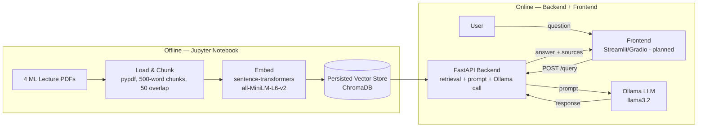

# RAG-Powered Document Assistant — ML Lecture Notes
# Project made by: Abdelrahman Khaled Abdelhamid and Omar Saad Abdelhakam


A Retrieval-Augmented Generation (RAG) assistant that answers questions about a
set of Machine Learning lecture PDFs, with grounded, cited answers. Built as
the graduation project for the Level 2 Summer Training program — **Core
Track** (text-only RAG, no Computer Vision/YOLO component).

> **Status:** Notebook (data pipeline) and backend (FastAPI) are complete.
> Frontend (Streamlit/Gradio) is not yet implemented — see
> [Project Status](#project-status) below.

---

## Table of Contents

- [Overview](#overview)
- [Architecture](#architecture)
- [Tech Stack](#tech-stack)
- [Project Structure](#project-structure)
- [Domain & Data](#domain--data)
- [Setup](#setup)
  - [1. Notebook (data pipeline)](#1-notebook-data-pipeline)
  - [2. Backend (FastAPI)](#2-backend-fastapi)
  - [3. Frontend](#3-frontend)
- [Environment Variables](#environment-variables)
- [API Reference](#api-reference)
- [Evaluation Results](#evaluation-results)
- [Screenshots](#screenshots)
- [Project Status](#project-status)

---

## Overview

This project takes a set of raw ML lecture PDFs and turns them into a working
RAG web application:

1. A Jupyter notebook loads the PDFs, chunks them, generates embeddings, and
   stores them in a persistent vector database (ChromaDB). It also builds and
   evaluates a retrieval + prompting pipeline against a local Ollama LLM.
2. A FastAPI backend serves that same pipeline behind a `/query` endpoint,
   loading the vector store and LLM connection once at startup.
3. A frontend (planned) will let a user ask a question and see a grounded,
   cited answer in a chat-style interface.

The core design goal is **grounding**: the assistant is instructed to answer
only from retrieved lecture content, cite the source document and page for
every answer, and explicitly say when something isn't covered in the
documents rather than making it up.

## Architecture



## Tech Stack

| Layer | Technology |
|---|---|
| Data pipeline | Jupyter Notebook, `pypdf`, `pandas` |
| Chunking | Custom fixed-size word-based chunker (500 words / 50 overlap) |
| Embeddings | `sentence-transformers` (`all-MiniLM-L6-v2`) |
| Vector store | ChromaDB (persistent, on disk) |
| LLM | Ollama (local), `llama3.2` |
| Backend | FastAPI, Pydantic / `pydantic-settings`, Uvicorn |
| Testing | `pytest`, FastAPI `TestClient` |
| Frontend *(planned)* | Streamlit or Gradio |
| Containerization | Docker (backend) |

## Project Structure

```
RAG/
├── notebooks/
│   └── rag_pipeline.ipynb        # Phases 0-2: setup, data loading, chunking,
│                                  # embeddings, retrieval, evaluation, export
├── data/
│   ├── documents/                # 4 source ML lecture PDFs
│   ├── vector_store/              # Persisted ChromaDB store (from the notebook)
│   └── evaluation_results.csv     # 10-question evaluation table (Phase 2.6)
├── backend/
│   ├── app/
│   │   ├── main.py                # FastAPI app, CORS, startup loading
│   │   ├── api/routes/query.py    # GET /health, POST /query
│   │   ├── core/config.py         # Settings from .env
│   │   ├── schemas/query.py       # QueryRequest / QueryResponse
│   │   ├── services/
│   │   │   ├── retrieval.py       # Loads vector store, retrieves chunks
│   │   │   └── generation.py      # Builds prompt, calls Ollama
│   │   └── utils/logging_config.py
│   ├── data/vector_store/         # Copy of the notebook's vector store
│   ├── tests/test_query.py        # Happy-path + invalid-input tests
│   ├── requirements.txt
│   ├── .env.example
│   └── Dockerfile
├── frontend/                      # Planned — not yet implemented
├── .gitignore
└── README.md
```

## Domain & Data

**Domain:** Machine Learning — introductory lecture material.

**Source documents** (`data/documents/`), 4 PDFs, ~6 MB total:

| File | Topic |
|---|---|
| `Lecture-1-Introduction-to-ML.pdf` | Introduction to Machine Learning (supervised/unsupervised learning, overfitting, decision trees, cross-validation) |
| `Lecture-2--Linear-Regression-.pdf` | Linear Regression (cost functions, gradient descent) |
| `Lecture-3---Optimization-Algorithms.pdf` | Optimization Algorithms |
| `Lecture-4---LOGISTIC-REGREssion.pdf` | Logistic Regression (classification vs. regression) |

All 4 files are text-extractable PDFs (verified in the notebook's Phase 2.1
inspection — no files required OCR). They were chunked into **238 chunks**
(500 words each, 50-word overlap) and embedded with `all-MiniLM-L6-v2` into a
`ml_lecture_notes` ChromaDB collection.

> The raw PDFs and the persisted vector store are committed directly to this
> repository (each well under the guideline's 50 MB threshold for small
> artifacts), so the project is reproducible without any extra download step.

## Setup

### 1. Notebook (data pipeline)

```bash
cd notebooks
python -m venv .venv
# Windows (PowerShell):
.venv\Scripts\Activate.ps1
# macOS / Linux:
source .venv/bin/activate

pip install jupyter pandas numpy chromadb sentence-transformers pypdf ollama python-dotenv
```

Make sure [Ollama](https://ollama.com) is installed and a model is pulled:

```bash
ollama pull llama3.2
```

Open `notebooks/rag_pipeline.ipynb` and run all cells top to bottom (Kernel →
Restart & Run All). This (re)builds `data/vector_store/` from the PDFs in
`data/documents/`.

### 2. Backend (FastAPI)

```bash
cd backend
python -m venv .venv
# Windows (PowerShell):
.venv\Scripts\Activate.ps1
# macOS / Linux:
source .venv/bin/activate

pip install -r requirements.txt
copy .env.example .env      # Windows
# cp .env.example .env      # macOS / Linux
```

Make sure `backend/data/vector_store/` contains a copy of the notebook's
persisted vector store (including `config.json`) — it's already included in
this repo, but if you rebuild the notebook, re-copy it here.

Run the API:

```bash
uvicorn app.main:app --reload
```

Open `http://localhost:8000/docs` to try `/query` from the interactive
Swagger UI.

Run the tests:

```bash
pytest
```

### 3. Frontend

Not yet implemented in this repository. Planned: a Streamlit or Gradio
chat-style interface under `frontend/`, calling the backend's `/query`
endpoint via an environment-configured `API_BASE_URL`.

## Environment Variables

Backend (`backend/.env`, copied from `backend/.env.example`):

| Variable | Default | Description |
|---|---|---|
| `VECTOR_STORE_PATH` | `data/vector_store` | Path to the persisted ChromaDB store |
| `OLLAMA_HOST` | `http://localhost:11434` | Ollama server address |
| `OLLAMA_MODEL` | `llama3.2` | Ollama model used for generation |
| `TOP_K` | `3` | Number of chunks retrieved per query |
| `CORS_ORIGINS` | `http://localhost:8501` | Comma-separated list of allowed frontend origins |

## API Reference

### `GET /health`

Liveness check.

**Response**
```json
{ "status": "ok" }
```

### `POST /query`

Retrieves the most relevant lecture chunks, builds a grounded prompt, and
calls the local Ollama LLM.

**Request body**
```json
{ "question": "What is gradient descent?" }
```

**Response body**
```json
{
  "answer": "Gradient Descent is a first-order iterative optimization algorithm for finding a local minimum of a differentiable function. ...",
  "sources": [
    "Lecture-2--Linear-Regression-.pdf (page 46)",
    "Lecture-3---Optimization-Algorithms.pdf (page 7)",
    "Lecture-3---Optimization-Algorithms.pdf (page 10)"
  ]
}
```

**curl example**
```bash
curl -X POST http://localhost:8000/query \
  -H "Content-Type: application/json" \
  -d "{\"question\": \"What is gradient descent?\"}"
```

## Evaluation Results

From the notebook's Phase 2.6 evaluation, run against 10 test questions
(full table in `data/evaluation_results.csv`):

| # | Question | Retrieved Source | Correct? |
|---|---|---|---|
| 1 | What is linear regression used for? | Lecture-2--Linear-Regression-.pdf (p.3) | ✅ |
| 2 | What is the difference between supervised and unsupervised learning? | Lecture-1-Introduction-to-ML.pdf (p.30) | ✅ |
| 3 | How does logistic regression differ from linear regression? | Lecture-4---LOGISTIC-REGREssion.pdf (p.32) | ✅ |
| 4 | What is overfitting and how can it be avoided? | Lecture-1-Introduction-to-ML.pdf (p.29) | ✅ |
| 5 | What is a decision tree? | Lecture-1-Introduction-to-ML.pdf (p.23) | ✅ |
| 6 | What is the purpose of a loss/cost function? | Lecture-2--Linear-Regression-.pdf (p.41) | ✅ |
| 7 | What is gradient descent? | Lecture-2--Linear-Regression-.pdf (p.46) | ✅ |
| 8 | What is the difference between classification and regression? | Lecture-4---LOGISTIC-REGREssion.pdf (p.4) | ✅ |
| 9 | What is cross-validation used for? | Lecture-1-Introduction-to-ML.pdf (p.16) | ✅ |
| 10 | What is a confusion matrix? | Lecture-1-Introduction-to-ML.pdf (p.20) | ❌ |

**Result: 9/10 correct and grounded.**

**Failure case:** Question 10 ("What is a confusion matrix?") — the model
responded that a confusion matrix is not explicitly covered in the retrieved
context, rather than fabricating an explanation. This is the grounding rule
working as intended: it correctly declined to hallucinate an answer for a
topic not present in the 4 lecture PDFs, instead of the assistant answering
from the LLM's own general knowledge (the "Common Mistake" the project
guideline specifically warns against).

## Screenshots

*To be added after the frontend is built and a full end-to-end demo
(question → API → retrieval → LLM → grounded answer on screen) is run.*

## Project Status

| Phase | Status |
|---|---|
| Phase 0 — Environment setup | ✅ Done |
| Phase 1 — Domain & data collection | ✅ Done |
| Phase 2 — Notebook: build & evaluate RAG pipeline | ✅ Done |
| Phase 3 — Backend (FastAPI) | ✅ Done |
| Phase 4 — Frontend (Streamlit/Gradio) | ⬜ Not started |
| Phase 5 — Publish on GitHub | ✅ This repository |
